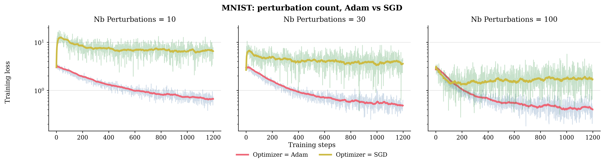
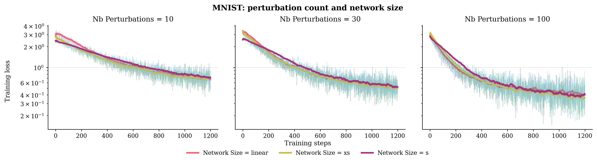

# Experiments

The main question is how many random directions are worth evaluating for a zeroth-order update. A larger perturbation budget can improve the gradient estimate, but every direction costs another model evaluation.

## MNIST: perturbation budget and optimizer

The experiment trains a linear `784 → 10` softmax classifier with 7,850 parameters. MNIST is split into 60,000 training and 10,000 test images; pixel values are normalized using the training-set mean and standard deviation. Each configuration uses one epoch, batches of 50, a one-sided perturbation scale $\delta=10^{-8}$, and seed 42. Runs use NumPy on CPU.

The sweep crosses $T\in\{10,30,100\}$ Rademacher directions with Adam (learning rate $10^{-3}$) and SGD (learning rate $0.1$). The directions are scaled by $1/\sqrt T$. At each of the 1,200 updates, the algorithm evaluates the nominal model and $T$ perturbed models on the same mini-batch.



| Directions $T$ | Loss evaluations per update | Adam test accuracy | SGD test accuracy |
| ---: | ---: | ---: | ---: |
| 10 | 11 | 81.04% | 76.16% |
| 30 | 31 | 85.70% | 80.77% |
| 100 | 101 | 88.35% | 84.08% |

In this run, test accuracy rises with $T$ for both optimizers. The figure also shows lower training loss for larger $T$ within each optimizer. This comes at a direct cost: at $T=100$, one update evaluates 101 parameter sets rather than 11 at $T=10$. NumPy batches those evaluations for the included neural network; batching reduces Python overhead, not the evaluation count.

These six models were initialized separately and saw different mini-batch orders. The learning rates also differ between Adam and SGD. The curves therefore illustrate the behavior of these configurations; they do not establish a causal effect of $T$, an optimal budget, or general superiority of one optimizer. Repeated runs with paired initializations and batch orders would be needed for stronger comparisons.

## MNIST: perturbation budget and network size

The second sweep holds Adam and the one-epoch protocol fixed while crossing the same three perturbation counts with a linear classifier and two small neural networks. The compact plot overlays the three architectures for each value of $T$.



| Directions $T$ | Linear | 128 hidden units | 128 and 64 hidden units |
| ---: | ---: | ---: | ---: |
| 10 | 80.93% | 80.56% | 80.08% |
| 30 | 85.29% | 86.00% | 85.60% |
| 100 | 88.57% | 88.87% | 88.42% |

Test accuracy increases with $T$ in each architecture in this run. At $T=100$, the three accuracies are close despite the different model sizes. These are independently initialized, single-epoch runs, so the table does not establish that architecture has no effect or that a given $T$ is optimal. The [metrics and loss traces](assets/experiments/model_size_seed42/) are preserved alongside the plot.

## Reproduce and inspect

```bash
uv sync --locked --extra mnist
MPLBACKEND=Agg uv run --locked --extra mnist python -m lab.mnist
MPLBACKEND=Agg uv run --locked --extra mnist python -m lab.mnist.run_experiment nb_perturbations_vs_model_size
```

The entry points are [`lab/mnist/main.py`](lab/mnist/main.py) and [`lab/mnist/run_experiment.py`](lab/mnist/run_experiment.py); models and variation values are defined in [`models.py`](lab/mnist/models.py), [`optimizers.py`](lab/mnist/optimizers.py), and [`variations.py`](lab/mnist/variations.py). The commands write plots, test metrics, and loss traces under `results/`. Copies in [`assets/experiments/seed42`](assets/experiments/seed42/) and [`assets/experiments/model_size_seed42`](assets/experiments/model_size_seed42/) preserve the data behind both figures.

Other configurations in `lab/mnist` explore learning rate, batch size, and Adam's moment coefficients. This page reports only the two sweeps reproduced with the current code.
