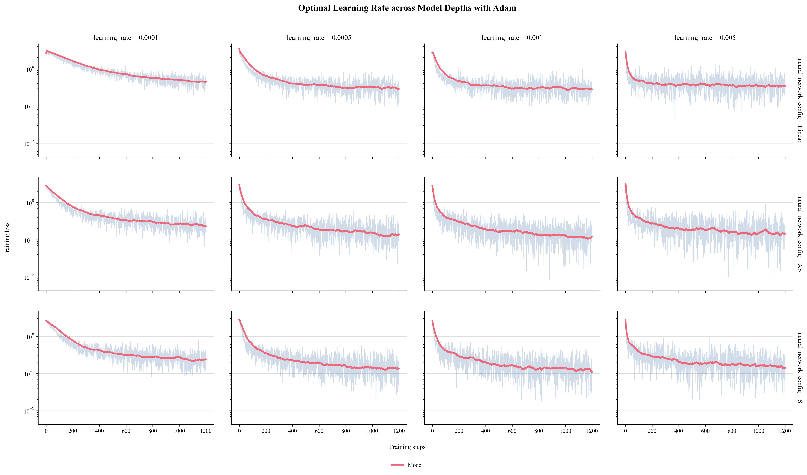
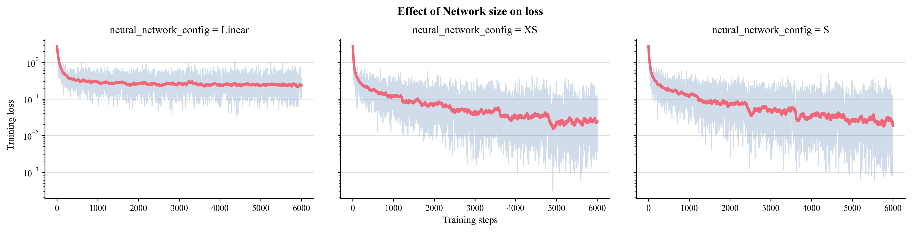
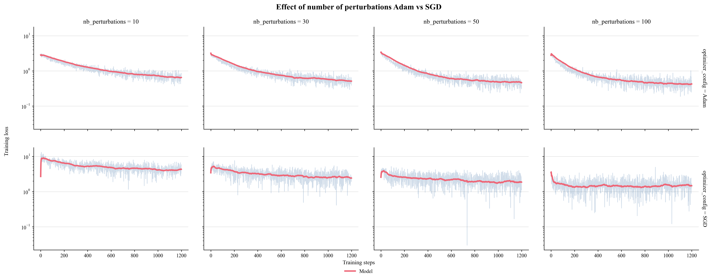

# Zeroth-Learn

**A research library for zeroth-order optimization (gradient-free) in machine learning, with applications to quantum computing.**

*Research project — Nicolas, X24*

---

## Context & Motivation

This project originated from a fundamental question in quantum machine learning:

> **How do you train parameterized quantum circuits when backpropagation is impossible?**

Quantum circuits are too complex to differentiate we treat it as a black box, thus we need to find alternatives to backpropagation, SPSA is an excellent candidate.

**SPSA (Simultaneous Perturbation Stochastic Approximation)** solves this by estimating gradients from only O(1) evaluations per iteration.

Before deploying on quantum simulators, I built this library to:
1. Understand the theoretical foundations of zeroth-order optimization
2. Validate SPSA stability on classical benchmarks (MNIST)
3. Validate my results with backpropagation models.

---

## Technical Implementation

### Architecture Decisions

**Problem**: Standard deep learning frameworks (PyTorch, JAX) are tightly coupled to automatic differentiation. I needed an architecture where gradient computation is a **swappable abstraction**.

**Solution**: Clean separation of concerns using abstract base classes:
```
Model (training loop orchestration)
  ├── NeuralNetwork (forward pass interface)
  │     ├── NeuralNetworkBackpropagation (layer-based, stores activations)
  │     └── NeuralNetworkPerturbation (parameter-vector based, no activation storage)
  └── Optimizer (gradient computation + update rule)
        ├── OptimizerBackprop (analytical gradients via chain rule)
        └── OptimizerPerturbation (estimated gradients via function evaluations)
```

**Key insight**: By treating gradients as an *estimated quantity* rather than an *exact derivative*, both methods become instances of the same abstraction.

---

## Quick Start

1.  **Clone the repository:**
    ```bash
    git clone https://github.com/nicolasmalet/Zeroth-Learn.git
    cd Zeroth-Learn
    ```

2.  **Install dependencies:**
    ```bash
    pip install -r requirements.txt
    ```

3.  **Run a benchmark experiment:**
    To train a linear MLP on MNIST using SPSA with 50 perturbations:
    ```bash
    python -m zeroth.lab
    ```
---

### SPSA Implementation Details

The core challenge: **evaluate multiple perturbed models in parallel without Python loops**.

#### Naive Approach (slow):
```python
for perturbation in perturbations:
    theta_perturbed = theta + perturbation
    loss_perturbed[i] = evaluate_model(theta_perturbed)
```
**Cost**: O(T) sequential forward passes for T perturbations.

#### Vectorized Approach (implemented):
```python
# Shape: (T, n_params)
pThetas = theta[None, :] + perturbations  

# Reshape to (T, n_layers) weight matrices
Ws, Bs = params.from_pThetas(pThetas)  

# Broadcast input across all T models simultaneously
# X: (input_dim, batch) -> (T, input_dim, batch)
for W, B, f in zip(Ws, Bs, fs):
    X = f(W @ X + B)  # Matrix multiplication broadcasts automatically
```
**Result**: All T forward passes execute in a single vectorized NumPy operation.

---

### Mathematical Rigor

#### Gradient Estimation
The SPSA gradient estimator:

$$\nabla L(\theta) \approx \frac{1}{T \cdot \delta^2} \sum_{i=1}^{T} \left( L(\theta + \delta \Delta_i) - L(\theta) \right) \Delta_i$$

where $\Delta_i \sim \text{Rademacher}(\pm 1)$ are random perturbation directions.

**Implementation** (using Einstein summation for efficiency):
```python
# L_diff: (T, batch_size), Ps: (T, n_params)
grad = np.einsum('ij,ik->k', L_diff, self.Ps) / (batch_size * T * delta)
```

#### Numerical Stability Considerations
- **Softmax**: Shifted by max to prevent overflow: `exp(x - max(x))`
- **CrossEntropy**: Added epsilon (1e-8) to prevent log(0)
- **Xavier initialization**: Weights sampled from $U(-\sqrt{6/(n_{in}+n_{out})}, +\sqrt{6/(n_{in}+n_{out})})$

---

## Experimental Validation

### Research Question
*What are the optimal conditions (architecture depth, learning rate, perturbation count) for SPSA to compete with backpropagation?*

### Methodology

**Phase 1: Hyperparameter Sensitivity Analysis**
- Grid search over learning rates × architectures
- Identified stability thresholds (divergence boundaries)



**Finding**: Adam requires lr ~ 0.001 for networks with 10K to 100K parameters to avoid gradient explosion in SPSA.

---

**Phase 2: Scalability Limits**
- Trained 6 models from 7K to 1.3M parameters (here are the first three)
- Measured convergence speed vs parameter count



**Finding**: Models with 100K parameters are sufficient to get 97% accuracy

---

**Phase 3: Sample Efficiency**
- Varied perturbation count T ∈ {10, 30, 50, 100}
- Measured gradient variance vs. computational cost



**Finding**: As gradient approximation variance reduction follows $\sigma \propto 1/\sqrt{T}$, we get marginal returns beyond T=50.

**Practical implication**: For quantum circuits, 50 evaluations/step is feasible on current hardware.

---

## Software Engineering Practices

### Type Safety & Configuration Management
- **Frozen dataclasses** for all configs → immutable
- **Config serialization** → full experiment reproducibility (saved as JSON)

### Modular Design
- **Catalog pattern** for hyperparameters (see `config.py`):
```python
  @dataclass(frozen=True)
  class OptimizerCatalog:
      AdamBackprop: AdamBackpropConfig = AdamBackpropConfig(lr=0.001, ...)
      AdamPerturbation: AdamPerturbConfig = AdamPerturbConfig(lr=0.001, ...)
```
  Enables experiment generation via `itertools.product`.

### Experiment Reproducibility
- Automatic result saving (loss curves, results dataframe, hyperparameter logs)
- Plot styling configured globally (publication-ready figures)

---

## Software Design Principles

- **Separation of Concerns**: Gradient computation (Optimizer) is decoupled from forward pass (NeuralNetwork)
- **Config-Driven**: All hyperparameters defined as immutable dataclasses → reproducibility
- **Polymorphism**: Models can swap between backprop and SPSA without code changes
---

## Skills Demonstrated

**Deep Learning Fundamentals**: Implemented backprop from scratch (no PyTorch/TensorFlow)  
**Numerical Optimization**: SPSA, Adam, gradient estimation theory  
**Scientific Computing**: Vectorized NumPy, broadcasting, numerical stability  
**Software Architecture**: Abstract base classes, config management  
**Research Methodology**: Systematic experimentation, reproducible results  
**Mathematical Rigor**: Gradient derivations, loss functions  

---

## Next Steps

### Quantum Simulation (In Progress)
- Implement `QuantumCircuitSimulator` class using Dynamics
- Test SPSA on parameterized quantum circuits
- Validate that convergence behavior matches classical benchmarks

---

## Technical Stack

**Language**: Python  
**Core Libraries**: NumPy (vectorization), Pandas (results), Matplotlib (visualization)  
**Design Patterns**: Strategy (Optimizer), Abstract Factory (Config instantiation), Template Method (Model training loop)

---

## Project Structure
```
zeroth/
├── core/
│   ├── backpropagation/       # Analytical gradient methods
│   │   ├── layer.py           # Forward/backward pass logic
│   │   └── optimizers.py      # SGD, Adam implementations
│   ├── spsa/                  # Zeroth-order methods
│   │   ├── perturbations.py   # Gradient estimation strategies
│   │   ├── params.py          # Parameter vector management
│   │   └── optimizers.py      # SPSA + Adam/SGD variants
│   ├── common/                # Shared abstractions
│   │   ├── losses.py          # MSE, CrossEntropy
│   │   ├── neural_network.py  # Abstract base class
│   │   └── optimizer.py       # Optimizer interface
│   └── experiment.py          # Experiment orchestration
└── lab/
    ├── experiments.py         # Pre-configured experiments
    ├── models.py              # Model definitions
    └── config.py              # Hyperparameter catalogs
```

---

## Contact

**Nicolas Malet**  
X24 — École Polytechnique  
nicolas.malet@polytechnique.edu  
[GitHub](https://github.com/nicolasmalet) | [LinkedIn](https://www.linkedin.com/in/nicolas-malet-pro)
