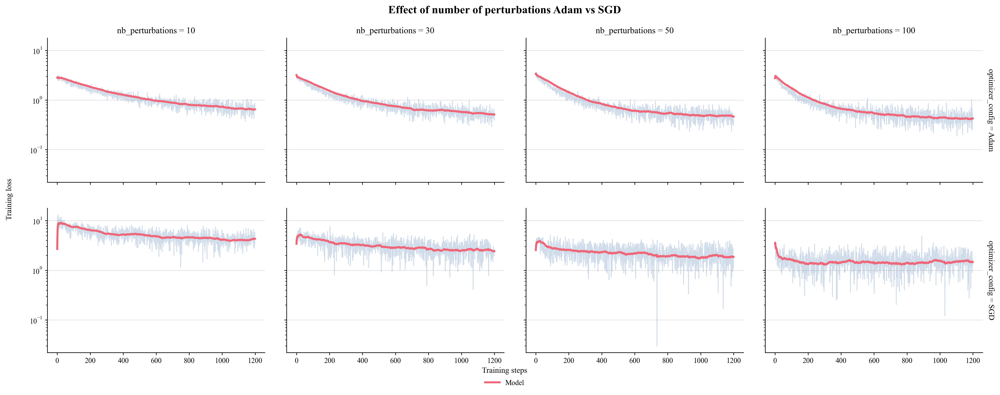

# Zeroth-Learn

Zeroth-Learn is Nicolas Malet's NumPy implementation of neural-network training when the loss can be evaluated but its gradient is unavailable. The project focuses on random-direction gradient estimation, its evaluation cost, and a vectorized implementation tested on MNIST.

## The problem

Let \(f(\theta)\) be a mini-batch loss for parameters \(\theta\in\mathbb{R}^d\). Backpropagation computes \(\nabla f(\theta)\) by differentiating the model. A black-box model exposes only values of \(f\), so the gradient must instead be inferred from nearby evaluations.

Coordinate-wise finite differences require a number of evaluations proportional to \(d\). Zeroth-Learn also implements a simultaneous-perturbation estimator whose evaluation count depends on a chosen number of directions \(T\), not directly on the number of parameters.

## Random-direction estimator

The implementation draws a matrix \(P\in\mathbb{R}^{T\times d}\). Its entries are independent Rademacher signs (\(+1\) or \(-1\) with equal probability), scaled by \(1/\sqrt{T}\). It evaluates the loss at the unperturbed parameters and along every row of \(P\):

$$
\widehat{\nabla f}(\theta)
= \frac{1}{\delta} P^\top
\begin{bmatrix}
f(\theta + \delta P_1)-f(\theta) \\
\vdots \\
f(\theta + \delta P_T)-f(\theta)
\end{bmatrix}.
$$

The Rademacher construction makes \(\mathbb{E}[P^\top P]=I\), so the first-order term of the estimator recovers the gradient in expectation. The code uses a one-sided difference: each update therefore needs one reference evaluation and \(T\) perturbed evaluations.

Increasing \(T\) averages over more random directions and can improve the estimate, but it also increases function evaluations and memory. This is the central trade-off explored by the MNIST experiments.

## Vectorized evaluation

Nicolas implemented the complete training path in NumPy:

1. flatten all weights and biases into one parameter vector \(\theta\);
2. construct the \((T+1)\) nominal and perturbed parameter vectors;
3. recover batched weight tensors for each layer;
4. evaluate every perturbed network through NumPy broadcasting;
5. aggregate the loss differences and update \(\theta\) with SGD or Adam.

The vectorization removes the Python loop over perturbations. It does not reduce the \(T+1\) black-box evaluations; it executes them as one batched array computation.

## What the experiments show

The repository applies the estimator to a linear `784 → 10` softmax classifier on MNIST. The configured sweep uses one epoch, batches of 50, Adam, \(\delta=10^{-8}\), and \(T\in\{10,30,100\}\). These experiments were run on CPU.



In the saved run, all three configurations reduce training loss, and larger values of \(T\) end at lower loss. Averaging more directions improved optimization in this experiment while requiring proportionally more perturbed evaluations. A single run cannot establish an optimal \(T\), expected performance across seeds, or a framework-level speed advantage.

The repository also contains saved sweeps over learning rate, network size, and Adam versus SGD. [`Plotting_Weights.ipynb`](Plotting_Weights.ipynb) is an executed analysis of the separate first-order linear baseline and its learned digit templates.

## Contribution

Nicolas designed and implemented:

- finite-difference and simultaneous-perturbation estimators;
- the Rademacher direction generator;
- the flat-to-structured parameter mapping;
- vectorized forward evaluation across perturbed models;
- first-order and zeroth-order SGD/Adam training paths;
- the MNIST experiment and plotting infrastructure.

The repository history contains a single contributor.

## Read the implementation

- [`gradient_estimators.py`](zeroth/zeroth_order/gradient_estimators.py): perturbations and gradient reconstruction.
- [`perturbation_matrices.py`](zeroth/utils/perturbation_matrices.py): Rademacher directions.
- [`neural_network.py`](zeroth/zeroth_order/neural_network/neural_network.py): vectorized perturbed forward pass.
- [`parameter_manager.py`](zeroth/zeroth_order/neural_network/parameter_manager.py): mapping between \(\theta\) and layer tensors.
- [`optimizers.py`](zeroth/zeroth_order/optimizers.py): SGD and Adam updates.
- [`lab/mnist`](lab/mnist/): experiment configurations and data pipeline.

## Run locally

Python 3.11 or later is recommended. The first MNIST run downloads the dataset from OpenML.

```bash
git clone https://github.com/nicolasmalet/Zeroth-Learn.git
cd Zeroth-Learn
python3 -m venv .venv
source .venv/bin/activate
python3 -m pip install -r requirements.txt -e .
MPLBACKEND=Agg python3 -m lab.mnist
```

## Limits

- The saved plots represent individual runs; seeds, repeated trials, and uncertainty estimates were not retained with the committed figures.
- MNIST is a classical validation problem, not evidence of performance on a quantum circuit or quantum device.
- Larger \(T\) increases both evaluation count and the memory used by the vectorized batch.
- The project does not provide a controlled CPU benchmark against another framework.

## Author

Nicolas Malet, École Polytechnique, X2024 · [GitHub](https://github.com/nicolasmalet) · [LinkedIn](https://www.linkedin.com/in/nicolas-malet-pro)
